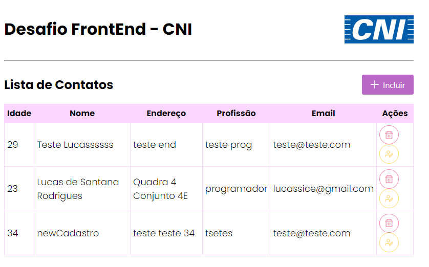

# Desafio CNI - Processo Seletivo

A implementação deste projeto, tem como finalidade, treinar conceitos básicos do angular.

## Autores

- [@lucassantanar](https://www.github.com/lucassantanar)

## Tela de demonstração



## Funcionalidades

- Aplicacação permite listagem, inserção, edição e exclusão de contatos.

## Stack utilizada

**Front-end:** Angular 2+, CSS, PrimgeNG12
**Back-end/Banco de Dados:** Firebase - Realtime Database

## Rodando localmente

Clone o projeto

```bash
  git clone https://github.com/lucassantanar/desafio-cni.git
```

Entre no diretório do projeto

```bash
  cd app-todo
```

Instale as dependências

```bash
  npm install
```

Inicie o servidor

```bash
  ng serve
```

## Documentação de cores

| Cor          | Hexadecimal                                                      |
| ------------ | ---------------------------------------------------------------- |
| Cor Primária |  #b052c0 |
